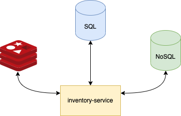

# Inventory POC

## Table of Contents

- [Over All Architecture](#architecture)
- [Challenge Constraint](#constraint)
- [Logging and Tracing](#usage)
- [Misc](#misc)

## Over All Architecture <a name = "architecture"></a>

In this project, the data will be stored just in memory app. But, in real case, we need real database to store the data.
There are severals solution, but this is just for general purpose


explanation:

- sql database will be used to store auth relation for user and URL path, since the data is relational data, it would be better to use sql
- no-sql database will be used to store stock inventory data, since the data only transactional data and probably it would be high transaction, it would be better to use no-sql data (constraint is R/W capability). we can use sql data to store stock data as well, but we need to take constraint to put indexing for the database. so read process can be optimized if the data become large
- redis is to caching stock data from GET API. if the data is updated, we must delete cache first or update it as well. so the data that shown to client keep up to date

## Challenge Constraint <a name = "constraint"></a>

`GET /stock/:id` return `not found`:

- this caused by there is no data in memory with requested id from the URL path
- if we just request `GET /stock/` the response will be `url not found` instead data not found. this because the url need specific additional `:id` at the end of URL. It recorded as different end point between general `GET /stock/` and specific `GET /stock:id`
- this endpoint also just return the data with `is_active` flag is `true`

POST data with payload below

```
{
    "name":"",
    "price": 0,
    "availability": 0,
    "is_active": false
}
```

- when we post the payload, it should be `BAD_REQUEST` since we have constraint that `availability` may be 0 (but not negative), but `price` may not

### Logging and Tracing <a name = "usage"></a>

this project is using [Zap SugarLogger](https://github.com/uber-go/zap). this logger has capabilities to trace the error message into root of the files. also, from the benchmark it shows better performance than others

in term of tracing, if we are talking about distributed tracing, I can suggest to use [Jaeger Tracing](https://github.com/jaegertracing/jaeger). This tracing library can trace the request flow end-to-end even it was different code base.

### Misc <a name = "misc"></a>

for auto update price, `isEnable` param in `main.go` file must be true. If it is enabled, it will be update the price od stocks automatically every 15 seconds
